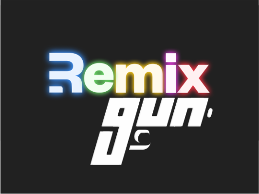
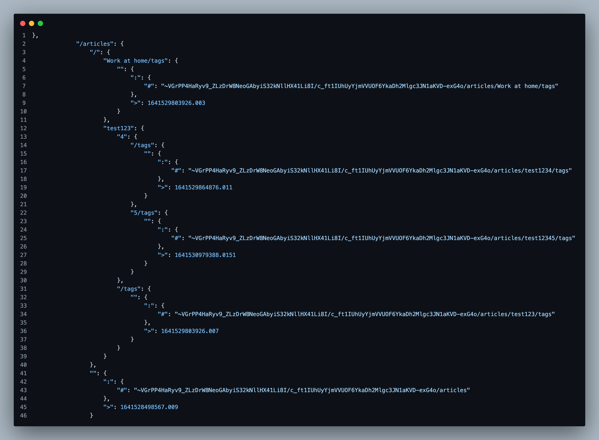

# Remix.Gun Boilerplate



This is my white-label boilerplate when building full stack apps. Using the Graph Universal Database, SEA authentication, and Remix's Express server adapter. 

## Goals

- [x] Relay GunDB inside the Remix Express Server  
- [x] Authorization with Gun.Sea/ Gun's user api
  - [ ] Password-less authorization. IN PROGRESS
- [x] Data writing / mapping with high level Gun function
- [x] Dynamic relay database peers
- [x] Docker Swarm deployment
- [ ] Cryptographic ledger 
- [x] Data Encrytion
- [ ] Data Compression
- [ ] Session Storage (needs improvment)



Radix Storage with fully encrypted data. Each registered user has public/ private encryption credentials.

## Development

You'll need to run two terminals (or bring in a process manager like concurrently/pm2-dev if you like):

Start the Remix development asset server

```sh
npm run dev
```

In a new tab start your express app:

```sh
npm run start:dev
```

This starts your app in development mode, which will purge the server require cache when Remix rebuilds assets so you don't need a process manager restarting the express server.

## Deployment

First, build your app for production:

```sh
npm run build
```

Then run the app in production mode:

```sh
npm start
```

Now you'll need to pick a host to deploy it to.


